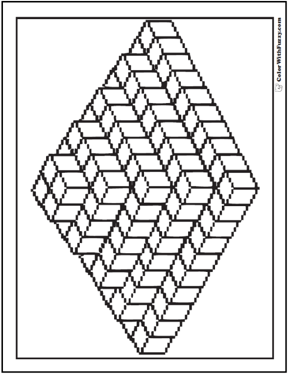
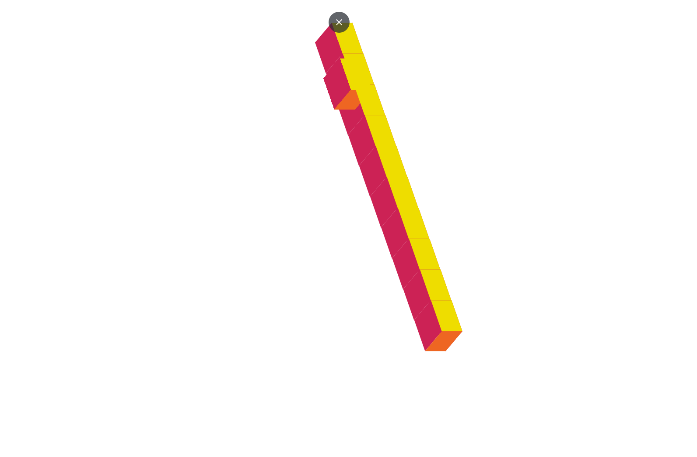

# objetivo
- recrear y animar la siguiente imagen en Zdog.js
)

<details open>
<summary>Estado actual del proyecto</summary>

## se crea la primera linea de 10


- el objeto esta creado con el siguiente codigo y despues se inserta en un bucle para generar los demas cubos
```JavaScript
let box = new Zdog.Box({
    addTo: Piramid,
    width: 120,
    height: 120,
    depth: 80,
    stroke: false,
    color: '#C25', // default face color
    leftFace: false,
    rightFace: faces[i],
    topFace: '#ED0',
    bottomFace: false,
    translate: {
        x: i * 36,
        y: i * 101
    },
    rotate: {
    x: 0,
    y: 1,
    z: 1
    },
```

</details>